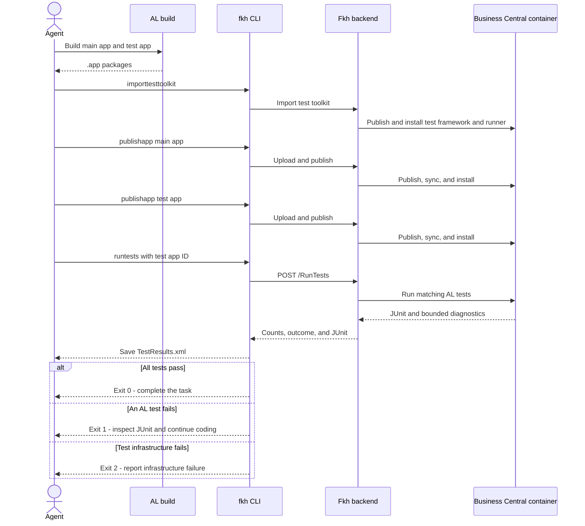

# Freddy's Kubernetes Helper (Fkh)


## License

This project is licensed under the [MIT License with Commons Clause](LICENSE).

**You may** freely use, modify, and deploy Fkh for your own organization at no cost.

**You may not** charge others for services that derive their value from this software.
This includes — but is not limited to — hosting Fkh for third parties, offering paid
consulting, support, or training based on Fkh, or reselling the software in any form.

**Exception:** Training delivered at conferences or free public sessions/webinars
open to the general Microsoft Business Central partner or developer community is
explicitly permitted and does not require a commercial license. Private sessions,
single-customer events, or events created primarily to circumvent this clause
are not covered by this exception.

If you want to offer commercial services around Fkh, a separate commercial license
is required. Contact [fkr@freddy.dk](mailto:fkr@freddy.dk) for details.

For official support plans — from free community support to enterprise-level
collaboration — see the [Support Service Agreement](Support%20Service%20Agreement.md).

## What is Freddy's Kubernetes Helper (Fkh)

Fkh lets authorised GitHub users work with Business Central containers and perform developer tasks on demand — directly from VS Code, a CLI, or GitHub Actions workflows.

A GitHub-authenticated Azure Function acts as the provisioning gate; Terraform manages all Azure and Kubernetes infrastructure.

### Core Platform
- Plug-and-play Kubernetes setup in your own Azure Subscription
- SQL Server Developer edition with persisted Premium SSD storage
- Autoscaling Windows node pool (scale to zero when idle)
- Optional spot/preemptible nodes for lower cost
- Overprovisioning for near-instant container scheduling
- Fast — containers typically spin up in 1–2 minutes when warm
- Zero human-managed secrets — managed identities, OIDC, and platform credentials only
- Open Source and free to use for your organization

### Container Management
- Create, start, stop, and remove containers with persisted databases
- Configurable CPU, memory, and auto-stop timers per container
- Auto-stop timer with notifications, extend, and admin override
- Full support for multitenancy and AAD/Entra ID authentication
- Custom database restore on create (from backup storage or SAS URL)
- Move all apps to dev scope after database restore
- Pre-pull (warm) images on all Windows nodes for instant starts
- Build and manage container images in Azure Container Registry

### Developer Productivity
- Publish .app files to running containers
- Run AL tests inside containers by published test app ID with JUnit output
- Run PowerShell scripts inside containers
- Copy files to and from containers
- Edit files in containers (download, edit locally, auto-upload on close)
- Open interactive PowerShell terminal in containers (kubectl or backend-based fallback)
- Time-limited external SQL access to container databases
- Execute SQL statements against container databases
- Backup, download, and upload database backups with versioning
- Query installed apps (filter by name, publisher, or appId with wildcards)
- Create and manage Business Central users with permissions, profiles, and license types

### Authentication & Authorization
- GitHub PAT and OIDC token authentication
- GitHub team-based authorization (member and admin teams)
- Brute-force protection (rate-limited failed attempts per IP)
- OIDC authentication from GitHub Actions workflows — no secrets needed

### VS Code Extension
- Catalog-driven command palette — all backend functions available automatically
- AL-Go Projects, Containers, Images, and VMs tree views with inline actions
- One-click container creation from AL-Go project tree
- Auto-update launch.json after container creation (configurable scope and properties)
- Auto-stop approaching notification with one-click extend
- Multi-account and multi-backend support
- Dynamic parameter prompting (file pickers, input boxes, webview forms)
- Admin-only parameters hidden from non-admin users
- Works in GitHub Codespaces and vscode.dev

### CLI
- Generic catalog-driven CLI — auto-discovers all backend functions
- Human-readable output by default, raw JSON with `--asJson`
- PowerShell tab completion
- Deployment repo creation and update (syncs workflow templates from your Fkh fork)
- `--nowait` mode for long-running operations

The typical coding-agent loop publishes freshly built app packages, runs the
published test app, and uses the JUnit result to decide whether to continue
coding or complete the task:



```powershell
fkh importtesttoolkit --name mycontainer
fkh publishapp --name mycontainer --appFile .\MyApp.app --install
fkh publishapp --name mycontainer --appFile .\MyTests.app --install
fkh runtests --name mycontainer --tenant default `
	--extensionId 11111111-1111-1111-1111-111111111111 `
	--testCodeunitRange "50100|50105..50110" `
	--appName "My Tests" --output TestResults.xml --useOIDC
```

Omit `--testCodeunitRange` to run every test codeunit in the specified test app.
The range uses standard Business Central filter syntax, allowing an agent or CI
workflow to pass the IDs of changed test codeunits.

A test run is aborted inside the container after 30 minutes. Pass
`--timeoutMinutes <1-120>` to use a different hard timeout for long-running
suites.

Test execution currently requires a container using `NavUserPassword`
authentication. The built-in toolkit import installs the toolkit in the
`default` tenant; for another tenant, install the Test Runner app there before
calling `runtests --tenant <tenant>`.

The command writes trustworthy, non-empty JUnit before returning. Exit code `0`
means all tests passed, `1` means JUnit contains test failures or errors, and `2`
means the request or test infrastructure failed.

### Admin Features
- Start and stop the entire AKS cluster with everything persisted
- System status dashboard (nodes, containers, SQL, storage, quotas, security)
- Per-user container quotas and default settings
- Stop all containers at once

### Infrastructure (Terraform)
- AKS cluster with Linux system pool and Windows worker pool
- Azure Container Registry with AKS pull and GitHub Actions push
- Azure Functions on Consumption plan
- Log Analytics, Application Insights, and Container Insights
- Optional Kubecost integration (per-pod cost allocation)

### Coming Soon
- One-click restore online database
- One-click bcapps development support

## Installation

Follow description under [Installation/README.md](Installation/README.md)

## Sponsors

Thanks to these sponsors for sponsoring the project:

# [](https://vcioglobal.com)
